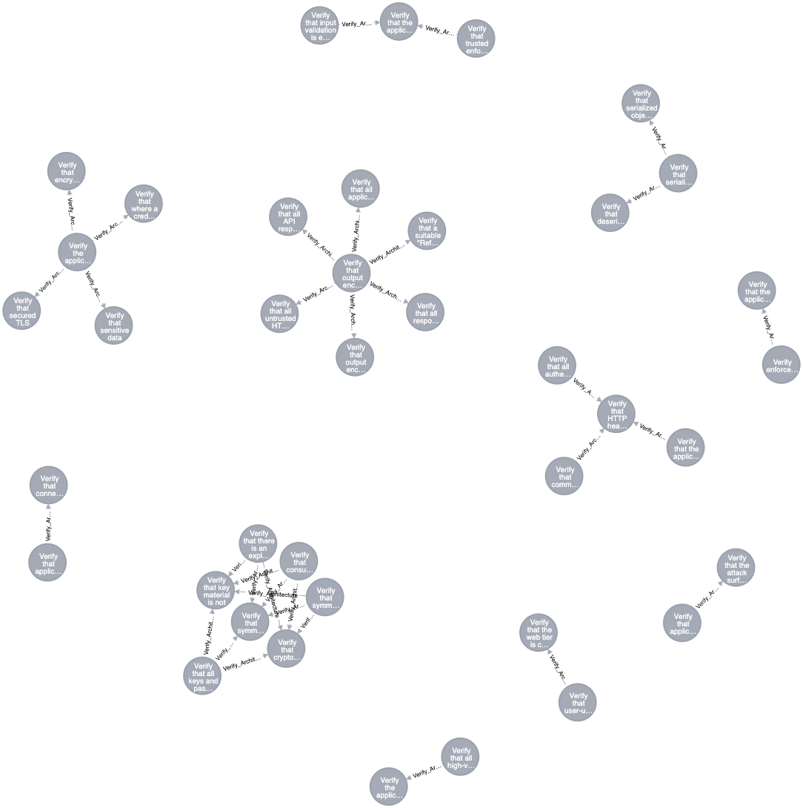

## Data Relationship - Architecture

- ASVS Requirements under Architecuture have a deeper relationships that are simply waiting to be explored.
- Below is a minified JSON view of ASVS Requirements with the following (Apologies for renaming columns in ASVS Graph - Consistency will be brought in soon).
  1. `serial` represents column `item` from ASVS.
  2. `description`represents coulumn `Description` from ASVS.
  3. `stage` represents column `Name` from ASVS.
- With ASVS-Graph, we make this view to be more fruitful by tying a strong relationship based on any attribute deemed fit.
  1. Helping us derive a relationship that `Architecture requirements` flow downwards to other `verification stages`.
  2. Paint us a broader picture that there is deeper relationship between different `verification stages`.
  3. Convert **Hunches** to more tangible requirements.

### ASVS-Graph for `Architecture Stage`



```
[
  {
    "a.serial": "1.6.1",
    "a.description": "Verify that there is an explicit policy for management of cryptographic keys and that a cryptographic key lifecycle follows a key management standard such as NIST SP 800-57.",
    "a.stage": "Architecture"
  },
  {
    "a.serial": "1.6.2",
    "a.description": "Verify that consumers of cryptographic services protect key material and other secrets by using key vaults or API based alternatives.",
    "a.stage": "Architecture"
  },
  {
    "a.serial": "1.6.3",
    "a.description": "Verify that all keys and passwords are replaceable and are part of a well-defined process to re-encrypt sensitive data.",
    "a.stage": "Architecture"
  },
  {
    "a.serial": "1.6.4",
    "a.description": "Verify that symmetric keys, passwords, or API secrets generated by or shared with clients are used only in protecting low risk secrets, such as encrypting local storage, or temporary ephemeral uses such as parameter obfuscation. Sharing secrets with clients is clear-text equivalent and architecturally should be treated as such.",
    "a.stage": "Architecture"
  },
  {
    "a.serial": "2.8.2",
    "a.description": "Verify that symmetric keys used to verify submitted OTPs are highly protected, such as by using a hardware security module or secure operating system based key storage.",
    "a.stage": "Authentication"
  },
  {
    "a.serial": "2.9.1",
    "a.description": "Verify that cryptographic keys used in verification are stored securely and protected against disclosure, such as using a TPM or HSM, or an OS service that can use this secure storage.",
    "a.stage": "Authentication"
  },
  {
    "a.serial": "6.4.2",
    "a.description": "Verify that key material is not exposed to the application but instead uses an isolated security module like a vault for cryptographic operations. ([C8](https://www.owasp.org/index.php/OWASP_Proactive_Controls#tab=Formal_Numbering))",
    "a.stage": "Cryptography"
  }
]
```
